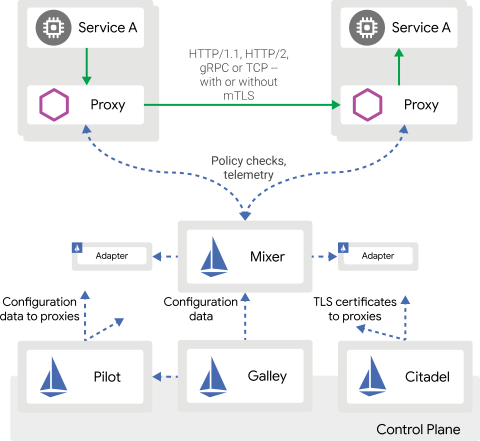

# 《云原生指南 Istio》

* 使用云平台可能会给 `DevOps 团队` 带来压力。`开发人员` 必须使用 **微服务** 来满足应用的可移植性
* Istio 有助于减低部署的复杂性，减轻 `开发团队` 的压力

---

## 什么是 Istio？

* 一个完全开源的服务网格，可以`透明地` `分层` 到现有的分层式应用程序上
* 一个平台，运行集成到任何日志记录平台、遥测或策略系统的 API

## 优点

对服务进行：

* 连接（connect）
* 保护（secure）
* 控制（control）
* 观测（observe）

高效地运行分布式微服务架构，提供 `连接`、`保护`、`控制`、`监控` 微服务的统一方法。

---

## 服务网格

Istio 可以解决从 `单体应用程序` 向 `分布式微服务架构` 转型中 `开发人员` 和 `运维人员` 面临的诸多问题（哪些问题？）。

服务网格（Service Mesh）用于描述构成这些（？）应用程序的微服务网络以及应用之间的交互。

服务网格的多样化需求：

* 服务发现
* 故障恢复
* 指标收集
* 监控
* 更加复杂的运维需求（A/B 测试、金丝雀发布、限流、访问控制和端到端认证等）

Istio 提供了一套完整的解决方案，通过为整个服务网格提供 `行为洞察` 和 `操作控制` 来满足微服务应用程序的多样化需求

---

## 为什么要使用 Istio？

Istio 提供了一种简单的方式来为 `已部署的服务` 建立网络，该网络具有 `负载均衡`、`服务间认证`、`监控` 等功能，并且几乎不需要对服务代码做任何修改。想要让服务支持 Istio，只需要在当前环境下部署一个特殊的 `sidecar 代理`，使用 Istio `控制面板` 功能配置和管理代理，拦截微服务之间的所有网络通信：

* `HTTP`、`gRPC`、`WebSocket` 和 `TCP` 流量的自动负载均衡（没有 UDP？）
* 通过丰富的 `路由规则`、`重试`、`故障转移` 和 `故障注入`，可以对流量行为进行 **细粒度控制**（有哪些细粒度控制？）
* 可插入的策略层和配置 API，支持 `访问控制`、`速率限制` 和 `配额`（把这些都一一实现一遍）
* 对所有出入集群的流量进行 `自动度量指标`、`日志记录` 和 `追踪`
* 通过强大的基于身份的认证和授权，保护集群中的服务间通信

Istio 为 `扩展性`（体现在哪？）而设计，并且满足不同的部署需求（哪些部署需求？）。

---

## 核心功能（Core features）

Istio 在服务网络中提供了许多关键的功能：

### 流量管理（Traffic management）

通过简单的 `规则配置`（rules configuration）和 `流量路由`（traffic routing），可以控制服务间的流量（flow of traffic）和 API 调用【实践一番】。Istio 简化了 `熔断`（circuit breakers）、`超时`（timeouts）和 `重试`（retries）等服务级属性的配置，并且轻松设置 `A/B 测试`（A/B testing）、`金丝雀发布`（canary rollouts）和 `基于百分比的流量分割的分阶段发布` 等重要任务【实践实践】。

通过更好地了解您的 `流量` 和开箱即用的 `故障恢复` 功能，您可以在出现问题之间捕获异常，使 API 调用更可靠，使您的网络更强壮 ———— 不论您面对什么条件。

### 安全（security）

Istio 的安全功能使开发人员可以专注于应用程序级别的安全性【具体怎么操作？】。Istio 提供了底层的安全通信隧道（secure communication channel）【源码分析或具体分析】，以及大规模管理服务通信（service conmunication）时的认证、授权和加密。使用 Istio，服务通信在默认情况下是安全的，使您可以跨多种协议和运行时（runtime）执行一致性策略【一致地执行策略？】 ———— 几乎不需要修改应用程序。

虽然 Istio 是独立于平台的，但将其与 Kubernetes 的网络策略结合使用，其优势会更大，包括在网络层和应用层保护 pod-to-pod 或 service-to-service 通信的能力【具体怎么做】。

### 观测性（Observability）

Istio 强大的 `追踪`（tracing）、`监控`（monitoring）和 `日志记录`（logging）功能可让你深入了解服务网格的部署【实践】。通过 Istio 的监控功能，真正理解 `服务性能`（service performance） 如何影响上游（upstream）和下游（downstream）的事物，而其定制的仪表板（dashboard）提供了对所有服务的性能的可视化，并使你了解性能如何影响您的其他进程【您可以通过其定制的仪表板查看所有服务的性能，并了解性能如何影响其他进程】。

Istio 的 Mixer 组件负责 `策略控制`（policy control）【如何控制？】和 `遥测收集`（telemetry collection）【如何收集？】。它提供后端抽象和中介，将 Istio 的其余部分与各个基础设施后端（infrastructure backends）隔离开来，并让运维人员对网格和基础设施后端之间的所有交互进行细粒度控制（fine-grained control）【哪些细粒度控制？】。

所有这些功能使您更可以更有小弟设置、监控和实施【执行？】服务上的 SLO【什么是 SLO？】。当然，最重要的是（底线是）你可以快速有效地检测和修复问题。

### 平台支持（Platform support）

Istio 与平台无关且可以运行在各种环境上，包括跨云、内部部署、Kubernetes 和 Mesos 等。您可部署在 Kubernetes 上或者在带有 Consul 的 Nomad 上部署 Istio 。Istio 目前支持：

* 在 Kubernetes 上的服务部署
* 使用 Consul 注册的服务
* 各个虚拟机上运行的服务

### 集成与定制（Integration and customization）

Istio 的策略执行组件可以扩展和定制，以便与已有的 `ACL`、`日志记录`（logging）、`监控`（monitoring）、`配额`（quota）、`审计`（auditing）等解决方案进行集成。

---

## 架构

Istio 服务网格逻辑上被分成 **数据平面**（data plane）和 `控制平面`（control plane）。

* **数据平面** 由一组部署为 sidecar 的智能代理（Envoy）组成。这些代理调解和控制微服务与 Mixer 之间的所有网络通信、通用策略和遥测中心（telemetry hub）
* **控制平面** 管理和配置代理以路由流量（route traffic）。此外，控制平面配置 Mixer 以实施策略和收集遥测数据。

下图展示了构成每个平面的不同组件：

【Mixer 如何进行策略检查和遥测？】
【mTLS 是什么？】
【Adapter 适配什么？】
【控制平面如何配置数据的？】

### Envoy

Istio 使用 Envoy 代理的扩展版本。Envoy 是一个用 C++ 开发的高性能代理，旨在调解服务网格中所有服务的全部入站（inbound）和出站（outbound）流量。Istio 利用了 Envoy 的许多内置功能【详解这些功能】，如：

* 动态服务发现（Dynamic service dicovery）
* 负载均衡（Load balancing）
* TLS 终止（TLS termination）
* HTTP/2 和 gRPC 代理
* 熔断（Circuit breakers）
* 健康检查（Health checks）
* 按百分比分隔流量的分阶段部署
* 故障注入（Fault injction）
* 丰富的度量指标（Rich metrics）

Envoy 部署作为 sidecar，与相应服务位于同一 Kubernetes Pod 中。这种部署方式允许 Istio 将关于流量行为的大量信号作为属性提取出来。反过来，Istio 可以在 Mixer 中使用这些属性来执行策略决策，并发送它们到监控系统以提供关于整个网格行为的信息。

Sidecar 代理模型也允许您添加 Istio 功能（capabilities）【哪些功能？】到现有部署中，而不需要重构（rearchitect）或重写代码。

### Mixer

Mixer 是一个平台无关的组件。Mixer 在服务网格中执行 `访问控制`（access control）和 `使用策略`（usage policies），以及从 Envoy 代理和其他服务中 `收集遥测数据`。代理提取请求级属性，并将它们发送给 Mixer 进行评估。You can find more information on this attribute extraction and policy evaluation in our Mixer Configuration documentation.

Mixer 包含一个灵活的 `插件模型`，该模型使 Istio 能够与各种主机环境（host environments）和基础设施后端（infrastruction backends）进行交互。因此，Istio 从这些细节中抽象出 Envoy 代理和 Istio 管理的服务。

### Pilot

Pilot 为 Envoy sidecar 提供 `服务发现` 功能，为智能路由提供 `流量管理` 功能（例如 A/B 测试、金丝雀发布等），以及弹性功能（超时、重试、熔断等）。

Pilot 将控制流量行为的高级路由规则转换成特定于 Envoy 的配置【怎么转换的？】，并在运行时将它们传播到 sidecar 。Pilot 抽象出特定于平台的服务发现机制，并将它们合成为所有符合 Envoy 数据平面 API 的 sidecar 都可以使用的标准格式。这种松耦合允许 Istio 在多种环境下运行，例如 Kubernetes、Consul 或 Nomad，同时保持相同的操作界面（operator interface）【运维接口？】用于流量管理。

### Citadel

Citadel 通过内置的身份和凭证管理实现了强大的服务到服务（service-to-service）和最终用户（end-user）认证。您可以使用 Citadel 升级服务网格中的未加密的流量。使用 Citadel，运维人员可以基于服务标识（service identity）实施策略，而不是基于相对不稳定的三层或四层网络标识符（network indentifiers）。从 0.5 版本开始，您可以使用 Istio 的 [授权功能](...) 来控制谁可以访问您的服务。

### Galley

Galley 是 Istio 的配置 `验证`（validation）、`摄取`（ingestion）、`处理`（processing）和 `分发`（distribution）组件。它负责将其余的 Istio 组件与从底层平台（例如 Kubernetes）获取到的用户配置细节中隔离开来。

---

## 设计目标（Design Goals）

一些关键的设计目标为 Istio 的架构提供了信息。这些目标对于使系统能够以大规模和高性能处理服务而言至关重要。

* **最大化透明度**：若要采用 Istio，运维人员和开发人员需要付出少量工作来从系统中获得实际价值。为此，Istio 可以自动将自身注入服务间的所有网络路径。
* **可扩展性**
* **可移植性**
* **策略一致性**

---

## UI

<https://github.com/jukylin/istio-ui>
<https://zhaohuabing.com/istio-practice/>
