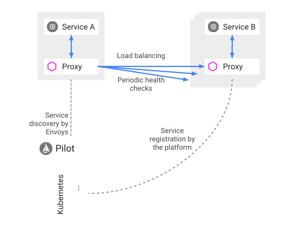

# 流量管理

使用 Istio 的流量管理模型实质上解耦了 `流量`（traffic flow）【包含流量分隔（traffic splitting）、流量转向（traffic steering）】和 `基础设施扩容`，让您通过 Pilot 来指定他们希望流量遵循什么规则，而不是哪些特定的 pod 或 VM 应该接收流量 ———— Pilot 和智能 Envoy 代理会搞定这些。例如，您可以通过 Pilot 将用于特定服务的 5% 流量发送到金丝雀版本，而不论金丝雀部署的规模大小，或根据请求的内容发送流量到特定版本。

将流量从基础设施扩容【什么是基础设施扩容？】中解耦，允许 Istio 提供位于应用程序代码之外的各种 **流量管理功能**，以及 `A/B 测试`、`逐步推出`（gradual rollouts）和 `金丝雀发布`（canary releases）的 **动态请求路由**（dynamic request routing），同时还使用 `超时`（timeouts）、`重试`（retries）、`熔断`（circuit breakers）和 `故障注入`（fault injection）来 **处理故障恢复**【如何处理？】，以测试跨服务的故障恢复策略的兼容性。这些功能都是通过服务网格中部署的 Envoy sidecar/proxy 实现的。

<!--
Istio 将流量从基础设施扩容中解耦后提供了哪些功能（通过服务网格中部署的 Envoy sidecar/proxy 实现的）：

1. 流量管理功能
2. 动态路由请求
3. 处理故障恢复
-->

## Pilot 和 Envoy

Istio 中用于流量管理的核心组件是 Pilot，它负责管理和配置在特定 Istio 服务网格中部署的所有 Envoy 代理实例。Pilot 允许您指定在 Envoy 代理之间路由流量的规则，以及配置故障恢复功能（如超时、重试、熔断）。Pilot 还维护网格中所有服务的规范模型（canonical model），使用该模型让 Envoy 实例通过其发现服务（rescovery service）了解网格中的其他 Envoy 实例。

每个 Envoy 实例根据从 Pilot 获取的信息以及对其负载均衡池中其他实例的定期讲课检查来维护 [负载均衡信息](..)，允许它在遵循指定的路由规则的同时在目标实例之间智能地分配流量。

Pilot 负责维护整个 Istio 服务网格中部署的 Envoy 实例的生命周期。

Pilot 在网格中维护服务的规范表现形式（canonical representation）【到底是啥意思？】，独立于底层平台。Pilot 中特定于平台的适配器负责适当地填充此规范模型。例如，在 Pilot 中的 Kubernetes 适配器实现了必需的控制器来监视 Kubernetes API server 为了改变 pod 的注册信息，ingress 资源以及存储流量管理规则的第三方资源。该数据被翻译成规范表现形式。然后基于规范表现形式生成特定于 Envoy 的配置。

Pilot 支持服务发现，动态更新到负载均衡池和路由表【不知道翻译得对不对】。

您可以通过 [Pilot 的路由规则](...) 指定高级流量管理规则。这些规则被翻译成低级配置【如何翻译？低级配置长什么样？】并分配给 Envoy 实例。

## 请求路由（Request routing）

如上所述，网格中服务的规范表现形式由 Pilot 来维护。服务的 Istio 模型独立于它在底层平台（Kubernetes、Mesos，Cloud Foundry 等）中的表示方法【好抽象】。特定于平台的适配器负责使用平台中找到的元数据中的各种字段填充内部模型表示【好抽象】。

Istio 引入了服务版本（Service version）的概念，这是一种通过版本（`v1`、`v2`）或环境（`staging`、`prod`）来细分服务实例的更细粒度的方法。这些变种不一定是不同的 API 版本：它们可以对同一服务迭代变化【更改？】，部署在不同的环境中（prod、staging、dev 等）。使用它的常见场景包括 A/B 测试或金丝雀发布。Istio 的 [流量路由规则](...) 可以引用服务版本来提供对服务间流量的额外控制。

### 服务间通信（Communication between services）

如上图所示，服务的客户端不知道服务的不同版本。它们可以使用服务的 hostname 或 IP 地址继续访问服务。Envoy sidecar/proxy 在客户端和服务之间拦截或转发所有请求或响应。

Envoy 根据您使用 Pilot 指定的路由规则动态确定实际选择的服务版本。该模型利用应用程序代码从其依赖的服务中解耦它自己，同时还提供其他好处（见 [Mixer](...)）。路由规则允许 Envoy 根据诸如 header、和源/目标相关的 tag、和/或分配给每个版本的权重（weights）条件来选择一个版本。

Istio 将流量负载均衡到相同服务版本的多个实例上。详见 [发现和负载均衡](...)。

Istio 不提供 DNS 。应用程序试图使用底层平台存在的 DNS 服务（kube-dns、mesos-dns 等）来解析 [FQDN](....)（）。

## 发现和负载均衡（Discovery and load balancing）

Istio 均衡流量服务网格中服务实例的流量。

Istio 假定存在服务注册表（service registry）以追踪应用程序中服务的 pod/VM 。同时，假定服务的新实例自动注册到服务注册表，并且不健康的实例自动被移除。诸如 Kubernetes 和 Mesos 之类的平台已经为基于容器的应用程序提供了这样的功能，并且基于 VM 的应用程序存在许多解决方案。

Pilot 消费来自服务注册表的消息并提供平台独立的服务发现接口。网格平台中的 Envoy 实例执行服务发现并相应地动态更新它们的负载均衡池。

如上图所示，网格中的服务使用其 DNS 名称相互访问。绑定到服务的所有 HTTP 流量将通过 Envoy 自动重新路由。Envoy 在负载均衡池中的实例中分配流量。虽然 Envoy 支持多种负责复杂的负责均衡算法，但 Istio 目前允许三种负载均衡模式：轮询（round robin）、随机（random）和加权最小请求（weigthed least request）。

除了负载均衡之外，Envoy 还会定期检查负载均衡池中的每个实例的健康状态。Envoy 遵循熔断模式，根据其对健康检查 API 调用的故障率将实例分成健康或不健康。换句话说，

## 处理故障（Handling failures）

## 故障注入（Fault injection）

## 金丝雀发布（Canary rollout）

## 规则配置（Rule configuration）

## 实践

* A/B 测试
* 金丝雀发布（灰度发布）
* 基于百分比的流量分割的分阶段发布

## 其他

* 蓝绿发布（Blue/Green Deployment）
* 滚动升级（Rolling update）
* 灰度发布（包括 A/B 测试、金丝雀发布）

比较：

| 发布方式 | 消耗资源     | 风险 |
| -------- | ------------ | ---- |
| 蓝绿发布 | 较多（两倍） | 小   |
| 滚动升级 | 不变         | 一般 |
|          |              |      |

## 参考

* [微服务部署：蓝绿部署、滚动部署、灰度发布、金丝雀发布](https://www.jianshu.com/p/022685baba7d)
